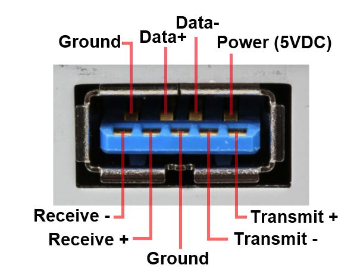

# USBMap

Python script for mapping USB ports in macOS and creating a custom injector kext.

***

# Features

- [x] No dependency on USBInjectAll
- [x] Can map XHCI (chipset, third party, and AMD), EHCI, OHCI, and UHCI ports
- [ ] ~~Can map USB 2 HUBs~~ *currently disabled*
- [x] Matches based on class name, not port or controller name
- [x] Allows setting nicknames to the last-seen populated ports in discovery
- [x] Aggregates connected devices via session id instead of the broken port addressing
- [x] Can use best-guess approaches to generate ACPI to rename controllers or reset RHUB devices as needed

***

# Index

- [Installation](#installation)
- [Vocab Lesson](#vocab-lesson)
- [What Is USB Mapping?](#what-is-usb-mapping)
  - [A Little Background](#a-little-background)
    * [Finding Ports](#finding-ports)
    * [The Port Limit](#the-port-limit)
    

***

## Installation

### With Git

Run the following one line at a time in Terminal:

    git clone https://github.com/corpnewt/USBMap
    cd USBMap
    chmod +x USBMap.command
    
Then run with either `./USBMap.command` or by double-clicking *USBMap.command*

### Without Git

You can get the latest zip of this repo [here](https://github.com/corpnewt/USBMap/archive/master.zip).  Then run by double-clicking *USBMap.command*

***

## Vocab Lesson

*Before we even get started, let's get familiar with some words because vocabulary is **fun**!*

~~Scary~~ Word | Definition
---------- | ----------
`Port` | A physical connection where you can plug a USB devices.  This could be a USB port on a case, a USB-C port, etc.
`Header` | Similar to a `Port`, but typically on the motherboard itself.  These often take a special connector, and typically either have internal devices plugged in (AiO pump controllers, Bluetooth devices, etc), or extensions that lead to ports at the front of your case when used.
`Chipset` | The hardware on the motherboard responsible for "data flow" between components (on my Maximus X Code, this is Intel's Z370 chipset).
`Controller` | The hardware responsible for managing USB ports.
`RHUB` or `HUBN` | A software device that provides information for each individual port
`OHCI` and `UHCI` | USB 1.1/1.0 protocol - `OHCI` is the "open" variant of `UHCI`.  They both do roughly the same thing, but are not interchangable or compatible with each other.
`EHCI` | USB 2.0 protocol with 1.0/1.1 backward compatibility.
`XHCI` | USB protocol used for USB 3 and newer - can emulate USB 2.0/1.1/1.0, but is a completely different protocol.
`Port Personality` | A software representation of a USB port.  May correspond to a physical `port`, internal `header`, or may be orphaned.
`Mapping` | In this context, the process of determining which `port personalities` correspond to which `ports` on which `controllers`.
`Full Speed`/`Low Speed` | USB 1.x
`High Speed` | USB 2.0
`Super Speed` | USB 3+
`Kexts` | A contraction of **K**ernel **Ext**ension - these are much like drivers and extend the functionality of the kernel.
`Injector` or `Codeless` kexts | A special type of kext that has no binary, and just expands the functionality of another kext.  Often used to add supported devices, or extra information.

***

## What Is USB Mapping?

*Alright kids, get out your cartography kits, we're going mapping!*

If you've been reading diligently thusfar, you probably caught the short definition in the [Vocab Lesson](#vocab-lesson).  We're going to expand on that a fair bit more though!  Simply put, USB mapping is the process used to determine which port personalities correspond to which physical ports.

### A Little Background

*Back in the glory days of Yosemite, we were spoiled.  Hackintoshes roamed free in the tech fields, grazing lazily on the abundant USB ports that sprouted from the fertile ground... Then El Capitan showed up - touting that mouse cursor trick where it gets bigger when you wiggle it around a bunch (and uh.. probably other useful features), and we Hack Ranchers gathered up our livestock and trotted wide-eyed to its enticingly greener pastures - little did we know, though, that Apple snuck something in the code that would prove to be a thorn in our sides for OS versions to come...*

There were some *major* under-the-hood changes regarding USB from 10.10 to 10.11!

#### Finding Ports


El Capitan changed the way the OS locates usable USB ports.  That discovery is done in 3 ways, prioritized in the following order:

1. Ports defined in injector kexts - OSX/macOS has some built-in injectors that define ports based on SMBIOS.
    * In 10.11-10.14 the port information is stored in `/System/Library/Extensions/IOUSBHostFamily.kext/Contents/PlugIns/AppleUSB[protocol]PCI.kext/Contents/Info.plist` where `[protocol]` is one of OHCI/UHCI/EHCI/XHCI
    * In 10.15+ the port information has been moved to a single file at `/System/Library/Extensions/IOUSBHostFamily.kext/Contents/PlugIns/AppleUSBHostPlatformProperties.kext/Contents/Info.plist`
    * These injectors match specific named devices in the IORegistry (XHC1, EHC1, EHC2)
    * We **do not** want to match with these, as your motherboard likely doesn't have the same ports, or same port number configuration as an iMac or otherwise...
2. If no devices match the injectors - OSX/macOS falls back on ACPI data.  Many motherboard manufacturers define RHUBs and USB ports in their DSDT, some use SSDTs, others don't define them at all, but *the most frustrating ones* only define **some** ports, causing the OS to ignore any that aren't defined.
3. If there's no ACPI data for the ports, OSX/macOS will then ask the hardware directly *"Hey bud, what kind of port action you rockin?"*

*Okay, so if we don't match built-in injectors, and we don't have ACPI information for our ports (or they're all defined properly), we're good, right?*

Uh... Let me set the scene...

#### The Port Limit:

*You finally got your install USB created, sweat pouring down your forehead as you plug that small instrument of black magic into a USB port and shakily press the power button.  The machine springs to life, fans whirring and circulating - lights all aglow.  Your display blinks, opens its metaphorical eyes and the BIOS splash screen greets you in its "I'm an 80s dream of the future" aesthetic - followed shortly by the boot picker for your boot manager of choice.  The selector moves to your install USB and you methodically press the Enter key.  Verbose text races across the screen, line by meticulous line, giving you a peek behind the curtain and into the heart of the boot process... but.. something's not right.  The text garbles... a large "prohibited" sign affixes itself squarely to the center of your display and seemingly taunts you as booting halts save for one slowly repeating line of garbled text.  Your eyes squint as you trace them over the mostly broken text... "Still waiting for root device..."*

*Wait... what just happened?*

One of the biggest changes to affect us Hackintoshers is that Apple now imposes a 15 USB port per controller limit.  At the surface, this doesn't sound terribly problematic.  Most motherboards have far fewer than 15 physical ports - not to mention some have third party chipsets that can share the load (since *each* controller has its own 15 port limit).

*Why 15?*

While this seems kinda arbitrary, it's actually a way to limit the addressing of ports to a single 4 bit address.  macOS/OSX displays devices using hexacdecimal addressing (0-9A-F) - and when a device has other *stuff* attached to it (like a USB RHUB would have ports attached), it uses the first device's address as the starting point, and increments the next digit for the attached device.

For instance - my chipset XHCI controller's RHUB shows up at `XHC@14000000`. That means the first port we add to that RHUB shows up at address `@14100000`, the second at `@14200000`, the 10th at `@14a00000`, and the 15th at `@14f00000`.  Each allowed port coming off the RHUB fits very neatly in one digit of addressing (cute!).  It gets a bit worrysome when you find out that *anything* above that `f` address **gets ignored** though...

*My motherboard doesn't have anywhere near 15 ports, so... what's the catch?*

I'm glad you asked!  Most modern motherboard USB controllers leverage the XHCI protocol to handle all their USB ports, and USB 3 is a bit *sneaky*.  Certainly far sneakier than its predecessors.

When EHCI (USB 2.0) came about, it was really just an expansion upon the existing UHCI/OHCI (USB 1.x) protocol which moved much of the responsibility of routing ports to the hardware side, so backward compatibility using the same physical port layout was pretty easy to ensure.  Many early EHCI controllers actually coexisted alongside UHCI or OHCI controllers.

XHCI sauntered in later with big plans of USB 3 - and to fully replace EHCI/UHCI/OCHI while wrapping all that USB goodness into one neat little package.  Our friend XHCI is a bit... *different* than the prior protocols though, so some emulation was required to achieve that functionality (some have had issues with this emulation, but most will never notice).

(You can read more about the different protocols [here](https://en.wikipedia.org/wiki/Host_controller_interface_(USB,_Firewire))!)

*Well, how is any of that sneaky though?*

Let's have a look at the inside of a USB 3 port (image courtesy of usb.com):



There's 9 pins in there - but they're setup very specifically.  A USB 2 or prior device would only leverage those top 4 pins, while a USB 3+ device actually takes advantage of those 4, *plus* the additional 5.  Every physical USB 3 port comes with *split personalities!*  When a USB 2 or prior device is plugged into a USB 3 port, it's *seen* as a USB 2 port personality - while a USB 3 device plugged into that same port is seen as a USB 3 port personality.  This means that every physical USB 3 port **takes up 2 of our limited 15 ports on that controller**.

Let's look at the ports on my Asus Maximus X Code and break down how this all works out.  Per the [spec page](https://www.asus.com/us/Motherboards/ROG-MAXIMUS-X-CODE/specifications/), we can see the following listed under the *USB Ports* header:

```
ASMedia® USB 3.1 Gen 2 controller :
1 x USB 3.1 Gen 2 front panel connector port(s)
ASMedia® USB 3.1 Gen 2 controller :
2 x USB 3.1 Gen 2 port(s) (2 at back panel, black+red, Type-A + USB Type-CTM)
Intel® Z370 Chipset :
6 x USB 3.1 Gen 1 port(s) (4 at back panel, blue, 2 at mid-board)
Intel® Z370 Chipset :
6 x USB 2.0 port(s) (4 at back panel, black, 2 at mid-board)
```

Let's break this down - there are 2 *separate* ASMedia controllers, one with a single USB 3.1 Gen 2 front panel connector, the other with 2 USB 3.1 Gen 2 ports on the back panel.  Neither of those should surpass the limit, as they're both only going to provide 2 USB 3.x ports, and since we know that each physical USB 3 port *counts as 2*, we can do some quick math and find how many total port personalities each of the ASMedia controllers provide:

- 1 USB 3.1 Gen 2 front panel connector (which breaks out into 2 physical USB 3.1 ports - *each with split personalities*) gives us **4 port personalities total**.
- 2 USB 3.1 Gen 2 (2 physical USB 3.1 ports - *each with split personalities*) gives us **4 port personalities total**.

4 personalities for each of the separate controllers is well under the 15 port limit, so we're **A OK** in that regard.


Looking on, there are 2 entries for the Z370 chipset, but this is a bit different.  There is only *one chipset*, and as such, both of these entries *share* the same controller.  That tightens up our wiggle room a bit, so let's look at how many total port personalities we're working with...

- 6 USB 3.1 Gen 1 (*each with split personalities*) gives us **12 port personalities**.
- 6 more USB 2.0 ports (these are physically USB 2, and do not have split personalities) gives us **6 port personalities**.

Combine the two values (since they share the chipset controller), and we're sitting at a toasty **18 port personalities total**.  *This is over the 15 port limit!*

*What happens if we're over the limit?*

~~More to come~~
